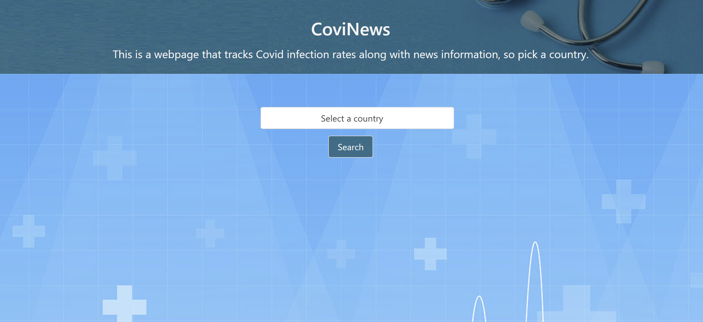
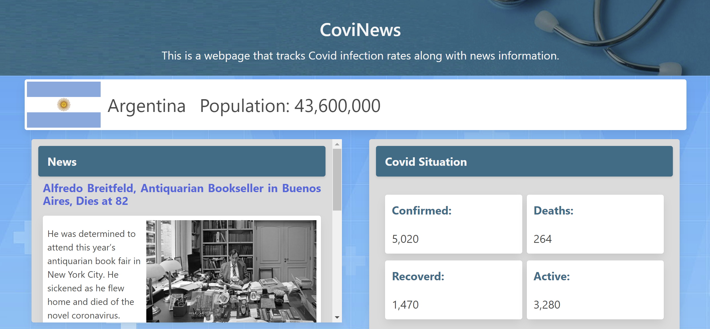

##Covid/News tracker

Summary:

We aim to build a web application that tracks Covid infection rates along with news information in a specific country/state/city.

Potential APIs:

- Covid tracker API (https://covid19api.com/)

- News API (https://api.nytimes.com/)

User Story:

As a user, I would like to have a webpage that tracks Covid infection rates along with news information related to a specific location…

So that I could be aware of the precautions to take and learn information…

With the benefit of being up to date on the latest covid statistics and news.

Application features/todo:
Show # of cases in a specific region
Search news in a specific country
Create wireframes and design

Mockups:
https://whimsical.com/mockups-project1-bootcamp-F6on7zMKGwz9wqYsHTKBZC

Webpage: https://venturecarbajal.github.io/project_one/

Main Page

Covid News & Stat Page

